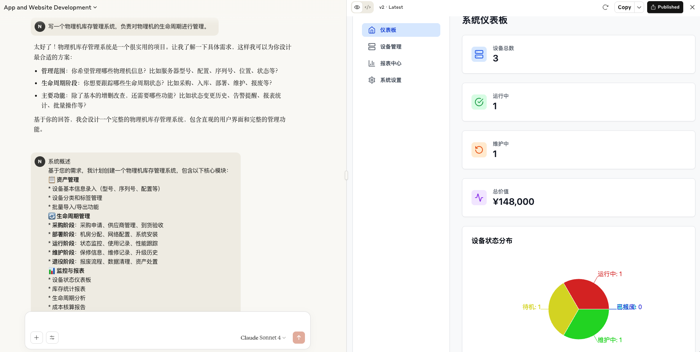
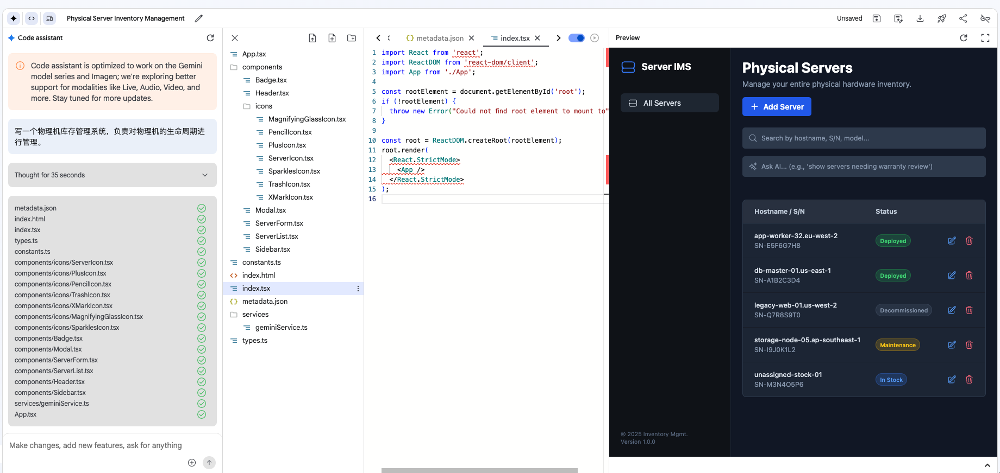

+++
date = '2025-06-29T18:00:00+08:00'
draft = false
title = 'Gemini-Cli'
+++

简单用了下claude artifact，效果如下：

我是普通账号，上下文长度有点短，生成之后就不能做修改了，步骤分解第一次是自己生成，截图这次是手动补充的。
后端接口接口不能直接发布，只能作为纯文本预览。

同样的提示词在aistduio上面用Gemini 2.5 pro效果就差了一些：

https://github.com/vllm-project/production-stack vllm官方的最佳实践

[letsencrypt 准备颁发IP证书了](https://letsencrypt.org/2025/07/01/issuing-our-first-ip-address-certificate/)

Gemini Cli 发布，可以免费用2.5 pro，超过以后会降到2.5 flash，还是比较良心的

TensorFlow 现在是不是比不上pytorch了？

曾几何时，TensorFlow是深度学习框架领域无可争议的王者。然而，近年来，战局已悄然改变。来自学术界和产业界的多方证据表明，由Meta AI（原Facebook AI Research）主导开发的PyTorch，在用户青睐度、社区活跃度和学术研究应用等多个关键指标上，已经超越了Google支持的TensorFlow。虽然TensorFlow在特定的工业生产环境中仍占有一席之地，但“PyTorch后来居上”已成为业界的普遍共识。

学术界的压倒性优势与开发者的普遍偏爱
目前，PyTorch在学术研究领域的主导地位尤为突出。根据PyTorch官方在2024年底发布的回顾报告，超过70%的AI研究论文实现采用了PyTorch。这一数据得到了各大顶级AI会议论文代码实现的印证，PyTorch的出现频率远高于TensorFlow。这种趋势的背后，是PyTorch以其简洁、灵活和“Pythonic”的编程风格赢得了广大学者和开发者的心。

工业界的版图变迁：从TensorFlow独大到两强并立
传统上，TensorFlow凭借其强大的生态系统，如用于模型部署的TensorFlow Serving、用于移动和嵌入式设备的TensorFlow Lite（TFLite）以及端到端机器学习平台TFX，在工业界，特别是大规模生产部署方面，占据了绝对优势。许多大型科技公司，包括Google自身，其内部大量的AI应用和系统都深度绑定了TensorFlow。

然而，随着PyTorch的日渐成熟和其生态的不断完善，这一格局正在被打破。PyTorch在2.0版本后，通过引入torch.compile等功能，显著提升了训练性能，缩小了与TensorFlow在速度上的差距。同时，TorchServe等部署工具的推出，也补齐了其在生产环境中的短板。

更重要的是，随着大量在校期间习惯使用PyTorch的学生和研究人员进入工业界，企业的新项目越来越倾向于采用PyTorch。许多公司，特别是那些追求快速迭代和创新的AI初创企业，已将PyTorch作为首选框架。虽然让拥有庞大TensorFlow技术栈的公司进行“伤筋动骨”的迁移尚不现实，但在新项目的选择上，天平已明显倾斜。

Hugging Face生态的“风向标”意义
作为全球最大的AI模型和数据集社区，Hugging Face上模型的框架分布是衡量框架流行度的重要“风向标”。尽管没有精确的官方统计数据持续发布，但社区的普遍观察和模型上传趋势显示，绝大多数最新的、SOTA（State-of-the-Art）的自然语言处理（NLP）模型，尤其是大语言模型（LLMs），都优先提供PyTorch版本。这得益于Hugging Face的Transformers库与PyTorch的无缝集成。开发者可以轻松地使用PyTorch对Hugging Face上的模型进行微调和再训练，这极大地促进了PyTorch在NLP领域的统治地位。

那什么又是 Pythonic 呢？

cline 可以从Gemini cli中调用2.5 pro的接口的，后续又去掉了，哈哈。

https://github.com/musistudio/claude-code-router 想用claude code但是没有合适的购买途径，就可以用这个项目。

| 特性 | 普通隧道代理 (Tunneling Proxy) | 解密/拦截代理 (Intercepting Proxy) |
| :--- | :--- | :--- |
| **能否看到明文** | ❌ **不能** | ✅ **可以** |
| **工作模式** | `HTTP CONNECT` 隧道模式 | 中间人攻击 (MITM) 模式 |
| **与服务器的连接** | 客户端与服务器端到端加密 | 代理分别与客户端和服务器建立加密连接 |
| **是否需要安装根证书** | 否 | **是 (关键步骤)** |
| **主要用途** | 访问控制、IP 伪装、网络路由 | 网络调试、安全审计、数据修改 |
| **典型例子** | 多数商业 VPN 或普通网络代理 | Mitmproxy, Burp Suite, Charles |

## 生活

bilibili首页刷到了某豪车租赁的账号。

[为啥AMD突然就把英特尔干趴了？](https://www.bilibili.com/video/BV1R67GzsEQf/)Intel的股价快到历史新低了。
