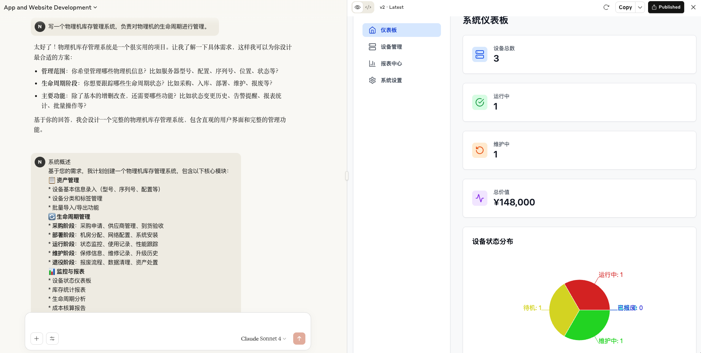
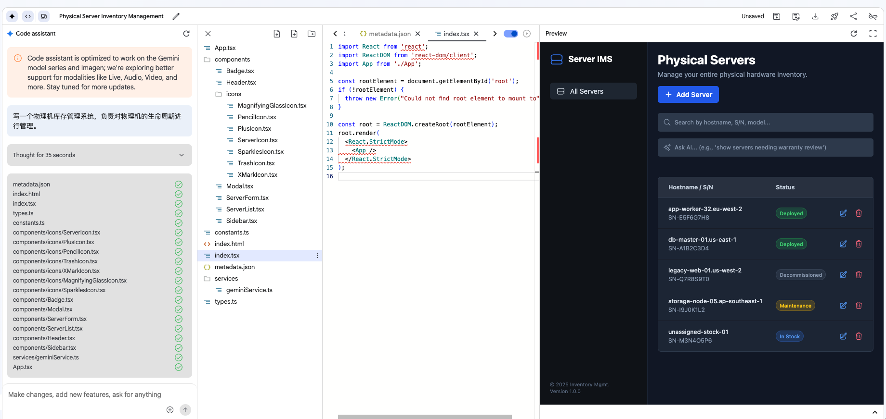

+++
date = '2025-06-29T18:00:00+08:00'
draft = false
title = '2025-06-29'
+++

简单用了下claude artifact，效果如下：

我是普通账号，上下文长度有点短，生成之后就不能做修改了，步骤分解第一次是自己生成，截图这次是手动补充的。
后端接口接口不能直接发布，只能作为纯文本预览。

同样的提示词使用Gemini 2.5 pro效果就差了一些。

https://github.com/vllm-project/production-stack vllm官方的最佳实践

cline 可以从Gemini cli中调用2.5 pro的接口的，后续又去掉了，哈哈。

## 生活
bilibili首页刷到了某豪车租赁的账号。
为啥AMD突然就把英特尔干趴了？Intel的股价快到历史新低了。