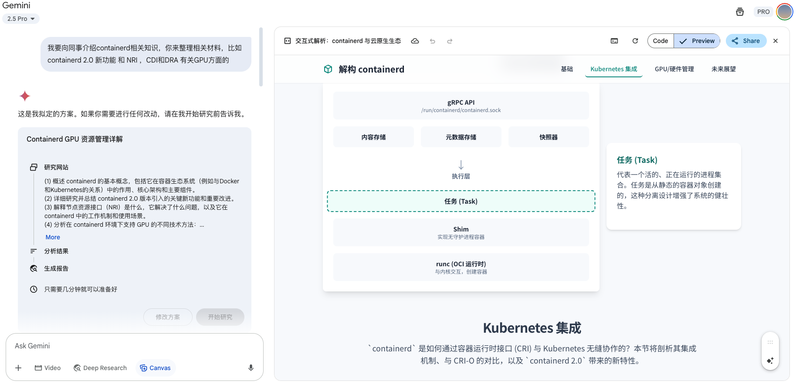

+++
date = '2025-07-05T15:45:23+08:00'
draft = false
title = 'Gemini Deep Research'
+++

体验过chatgpt，豆包，Qwen，和Gemini的深度研究之后，个人感觉Gemini是最好的。
首先会生成研究方向，搜索关键字，然后可能是通过tool call的方式抓取相关内容，最好生成的结果可以用来创建到Web Page（可交互），Infographic，Quiz和音频。

---

k8s 中 prometheus的 token 是如何访问经过认证的kube-controller-manager的/metrics的？

答案是：**证书验证（TLS）和Token授权（RBAC）是两个独立但连续的步骤。`kube-controller-manager`自己处理TLS握手，但会将授权决策委托**给`kube-apiserver`。

1.  **认证 (Authentication) - 使用 `TokenReview`**：

      * `kube-controller-manager`接收到Token后，它会创建一个`TokenReview`对象。这个对象包含了它从Prometheus收到的原始Token。
      * 它向`kube-apiserver`的`/apis/authentication.k8s.io/v1/tokenreviews`端点发起一个请求，内容就是这个`TokenReview`对象。
      * `kube-apiserver`收到请求后，会验证这个Token的签名和有效性。如果Token有效，`kube-apiserver`会在`TokenReview`对象的状态（status）字段中填充该Token对应的用户信息（用户名、UID、所属组等），并返回给`kube-controller-manager`。
      * 现在，`kube-controller-manager`知道了这个请求的发起者是谁（例如，`system:serviceaccount:monitoring:prometheus-k8s`）。

2.  **授权 (Authorization) - 使用 `SubjectAccessReview`**：

      * 在知道了请求者的身份后，`kube-controller-manager`需要确认这个身份是否有权限执行请求的操作（即对`/metrics`路径进行`GET`操作）。
      * 它会创建一个`SubjectAccessReview`对象。这个对象里包含了上一步获取到的用户信息以及本次请求试图执行的操作（`verb: "get"`, `nonResourceURL: "/metrics"`）。
      * 它向`kube-apiserver`的`/apis/authorization.k8s.io/v1/subjectaccessreviews`端点发起请求。
      * `kube-apiserver`收到请求后，会查询集群中所有的RBAC规则（`Role`, `ClusterRole`, `RoleBinding`, `ClusterRoleBinding`），判断这个用户是否有权限执行该操作。
      * `kube-apiserver`将检查结果（允许或拒绝）填充到`SubjectAccessReview`对象的状态字段中，并返回给`kube-controller-manager`。

3.  **最终决策**：

      * `kube-controller-manager`收到`SubjectAccessReview`的响应后，如果结果是“允许”，它就会向Prometheus返回`/metrics`的数据。
      * 如果结果是“拒绝”，它会向Prometheus返回`403 Forbidden`错误。

这保证了整个集群的认证授权策略是统一和集中的，避免了每个组件各自为政带来的安全风险和管理复杂性。

---
k8s 为什么要设计service/proxy的子资源?

AI生成了4个理由，我觉得唯一有点说服力的也就第三条。

3. 提供稳定的编程接口（Programmatic Access）
通过提供一个标准的 RESTful API 端点（GET /api/v1/namespaces/{namespace}/services/{service-name}:{port-name}/proxy/{path}），Kubernetes 为自动化工具和自定义控制器（Controller）提供了一个与内部服务交互的稳定接口。

一个经典案例就是 Kubernetes 早期的监控组件 Heapster（现在已被 Metrics Server 取代），它就是通过 service/proxy 接口去轮询各个组件（如 Kubelet）的 metrics 端点来采集监控数据的。这使得集群扩展组件的开发变得更加简单和标准化。

1. 精细化的权限控制（RBAC）
2. 简化开发与调试工作
4. 符合逻辑的 RESTful API 设计
